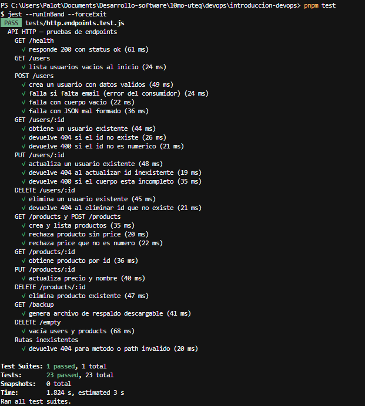

# Práctica DevOps — Pruebas unitarias del API HTTP

**Universidad Tecnológica de Querétaro**  
**Materia:** Gestión del Proceso de Desarrollo de Software  
**Docente:** Emmanuel Martinez Hernandez  
**Estudiante:** Pablo Abraham Guerrero Alvarado  
**Matrícula:** 2022371197

## Descripción

Se implementaron **pruebas unitarias** sobre los endpoints REST del API HTTP (Express + SQLite), usando **Jest** como framework y **Supertest** para simular peticiones sin levantar el servidor en el puerto de producción. Las pruebas usan una base SQLite temporal para no alterar `database.sqlite` del entorno local.

El archivo de pruebas está en `tests/http.endpoints.test.js`. Para ejecutarlas:

```bash
pnpm test
```

| Herramienta | Uso |
|-------------|-----|
| Jest | Runner de pruebas y aserciones |
| Supertest | Peticiones GET, POST, PUT y DELETE contra la app Express |
| SQLite (temporal) | Datos aislados por ejecución (`beforeEach` vacía tablas) |

Se cubren **13 rutas** (más de las 10 mínimas requeridas), incluyendo métodos **GET**, **POST**, **PUT** y **DELETE**:

| Método | Ruta |
|--------|------|
| GET | `/health`, `/users`, `/users/:id`, `/products`, `/products/:id`, `/backup` |
| POST | `/users`, `/products` |
| PUT | `/users/:id`, `/products/:id` |
| DELETE | `/users/:id`, `/products/:id`, `/empty` |

Además se validan **escenarios de fallo** que un consumidor del API puede provocar: cuerpo vacío, campos obligatorios faltantes, JSON mal formado, identificadores no numéricos o inexistentes, `price` inválido en productos y rutas que no existen (404).

## Evidencias

### 1. Ejecución de la suite de pruebas



Salida de `pnpm test`: **23 pruebas** en **1 suite**, todas en estado **PASS**. Incluye casos exitosos y casos de error (400, 404) documentados en el archivo de pruebas.

### 2. Ejemplo de prueba de creación (POST /users)

```javascript
const res = await request(app)
    .post('/users')
    .send({ name: 'Ana', email: 'ana@mail.com' });

expect(res.status).toBe(201);
expect(res.body.data).toMatchObject({ name: 'Ana', email: 'ana@mail.com' });
```

Respuesta esperada: `statusCode` 201 y objeto usuario con `id` numérico.

### 3. Ejemplo de fallo por datos incompletos (POST /users)

```javascript
const res = await request(app).post('/users').send({ name: 'Sin email' });
expect(res.status).toBe(400);
expect(res.body.data.message).toMatch(/name y email/i);
```

Respuesta esperada: **400** cuando el cliente omite campos requeridos.

### 4. Ejemplo de actualización (PUT /products/:id)

```javascript
const res = await request(app)
    .put(`/products/${id}`)
    .send({ name: 'Cable HDMI', price: 15.5 });

expect(res.status).toBe(200);
expect(res.body.data).toMatchObject({ name: 'Cable HDMI', price: 15.5 });
```

Respuesta esperada: **200** con el producto actualizado; **404** si el `id` no existe.

## Conclusión

El API HTTP quedó cubierto con pruebas automatizadas que verifican operaciones CRUD sobre usuarios y productos, endpoints auxiliares (`/health`, `/backup`, `/empty`) y respuestas de error ante entradas incorrectas. La evidencia en captura confirma que la suite completa pasa de forma reproducible con `pnpm test`, alineada con los requisitos de la actividad (Jest, al menos 10 endpoints y escenarios de fallo del usuario).
